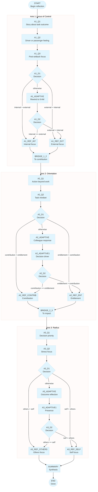

```mermaid
%%{init: {'theme': 'base', 'themeVariables': { 'primaryColor': '#e1f5fe', 'edgeLabelBackground':'#ffffff'}}}%%
graph TD

START([START<br/>Begin reflection])

subgraph Axis1 [Axis 1: Locus of Control]
direction TB
A1_Q1[A1_Q1<br/>Story about task outcome]
A1_Q2[A1_Q2<br/>Driver or passenger feeling]
A1_Q3[A1_Q3<br/>Post-setback focus]
A1_D1{A1_D1<br/>Decision}
A1_ADAPTIVE[A1_ADAPTIVE<br/>Rewind to 9 AM]
A1_D2{A1_D2<br/>Decision}
A1_REF_INT[[A1_REF_INT<br/>Internal focus]]
A1_REF_EXT[[A1_REF_EXT<br/>External focus]]
BRIDGE_1_2(BRIDGE_1_2<br/>To contribution)
end

subgraph Axis2 [Axis 2: Orientation]
direction TB
A2_Q1[A2_Q1<br/>Action beyond work]
A2_Q2[A2_Q2<br/>Task mindset]
A2_D1{A2_D1<br/>Decision}
A2_ADAPTIVE[A2_ADAPTIVE<br/>Colleague response]
A2_ADAPTIVE1[A2_ADAPTIVE1<br/>Decision driver]
A2_D2{A2_D2<br/>Decision}
A2_REF_CONTRIB[[A2_REF_CONTRIB<br/>Contribution]]
A2_REF_ENT[[A2_REF_ENT<br/>Entitlement]]
BRIDGE_2_3(BRIDGE_2_3<br/>To impact)
end

subgraph Axis3 [Axis 3: Radius]
direction TB
A3_Q1[A3_Q1<br/>Decision priority]
A3_Q2[A3_Q2<br/>Stress focus]
A3_D1{A3_D1<br/>Decision}
A3_ADAPTIVE[A3_ADAPTIVE<br/>Outcome reflection]
A3_ADAPTIVE1[A3_ADAPTIVE1<br/>Presence]
A3_D2{A3_D2<br/>Decision}
A3_REF_OTHERS[[A3_REF_OTHERS<br/>Others focus]]
A3_REF_SELF[[A3_REF_SELF<br/>Self focus]]
end

SUMMARY[[SUMMARY<br/>Synthesis]]
END([END<br/>Done])

START --> A1_Q1
A1_Q1 --> A1_Q2
A1_Q2 --> A1_Q3
A1_Q3 --> A1_D1

A1_D1 -->|internal > external| A1_REF_INT
A1_D1 -->|external > internal| A1_REF_EXT
A1_D1 -->|otherwise| A1_ADAPTIVE

A1_ADAPTIVE --> A1_D2
A1_D2 -->|internal >= external| A1_REF_INT
A1_D2 -->|external > internal| A1_REF_EXT

A1_REF_INT --> BRIDGE_1_2
A1_REF_EXT --> BRIDGE_1_2
BRIDGE_1_2 --> A2_Q1

A2_Q1 --> A2_Q2
A2_Q2 --> A2_D1

A2_D1 -->|contribution > entitlement| A2_REF_CONTRIB
A2_D1 -->|entitlement > contribution| A2_REF_ENT
A2_D1 -->|otherwise| A2_ADAPTIVE

A2_ADAPTIVE --> A2_ADAPTIVE1
A2_ADAPTIVE1 --> A2_D2

A2_D2 -->|contribution >= entitlement| A2_REF_CONTRIB
A2_D2 -->|entitlement > contribution| A2_REF_ENT

A2_REF_CONTRIB --> BRIDGE_2_3
A2_REF_ENT --> BRIDGE_2_3
BRIDGE_2_3 --> A3_Q1

A3_Q1 --> A3_Q2
A3_Q2 --> A3_D1

A3_D1 -->|others > self| A3_REF_OTHERS
A3_D1 -->|self > others| A3_REF_SELF
A3_D1 -->|otherwise| A3_ADAPTIVE

A3_ADAPTIVE --> A3_ADAPTIVE1
A3_ADAPTIVE1 --> A3_D2

A3_D2 -->|others >= self| A3_REF_OTHERS
A3_D2 -->|self > others| A3_REF_SELF

A3_REF_OTHERS --> SUMMARY
A3_REF_SELF --> SUMMARY
SUMMARY --> END
```